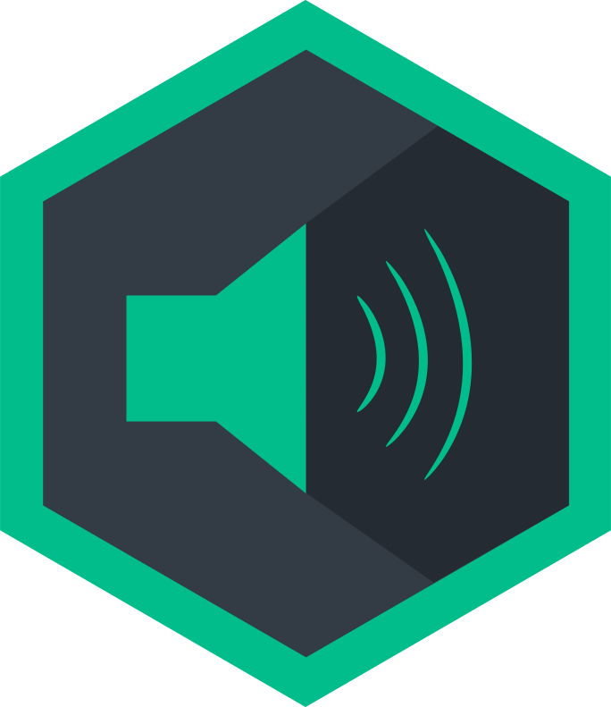

<h1 align="center">
   
  
   
   
  node-sonos
   
   
</h1>

  <b>Control your Sonos devices with JavaScript (node.js)</b>

  
  
  
  

**node-sonos** gives you the power to control all your Sonos devices from your own apps in JavaScript. Automatically discover your devices on the network and control the playback and queue with instant events announcing change.

## Features

* Device Discovery
* Queue Control
* Volume Control
* Spotify Support
* Radio
* Change Events

## Install

Published versions (reccomended)

    $ npm install sonos

From the repo, living on the edge

    $ npm install git://github.com/bencevans/node-sonos.git

## API

For detailed info read the [/API.md](https://github.com/bencevans/node-sonos/blob/master/API.md) file, else…

* search([options], [deviceAvailableListener])
* Class: Search([options])
  * Event: 'DeviceAvailable'
  * destroy()
* Class: Sonos(host, [port])
  * currentTrack(callback)
  * deviceDescription(callback)
  * flush(callback)
  * getCurrentState(callback)
  * getLEDState(callback)
  * getMusicLibrary(search, options, callback)
  * getMuted(callback)
  * getTopology(callback)
  * getVolume(callback)
  * getZoneAttrs(callback)
  * getZoneInfo(callback)
  * getQueue(callback)
  * next(callback)
  * parseDIDL(didl)
  * pause(callback)
  * play(uri, callback)
  * previous(callback)
  * queue(uri, positionInQueue, callback)
  * queueNext(uri, callback)
  * request(endpoint, action, body, responseTag, callback)
  * seek(seconds, callback)
  * setLEDState(desiredState, callback)
  * setMuted(muted, callback)
  * setName(name, callback)
  * getPlayMode(callback)
  * setPlayMode(mode, callback)
  * setVolume(volume, callback)
  * stop(callback)
  * setSpotifyRegion(region)
  * alarmClockService()
    * ListAlarms(callback)
    * PatchAlarm(id,options,callback)
    * SetAlarm(id,enabled,callback)
  * startListening(options, callback)
  * stopListening(callback)
  * Event: 'TrackChanged'
  * Event: 'VolumeChanged'
  * Event: 'StateChanged'
  * Event: 'Muted'

## In The Wild

node-sonos in use across the interwebs. Missing yours? [Add it](https://github.com/bencevans/node-sonos/edit/master/README.md) and send us a pull request!

### Apps

* **[AirSonos](https://github.com/stephen/airsonos)** - Apple AirPlay (iOS, OS X) support to all Sonos devices on a network.
* **[sonos-cli](https://github.com/bencevans/sonos-cli)** - Command Line Interface for Sonos
* **[sonos2mqtt](https://github.com/svrooij/sonos2mqtt)** - Bridge between Sonos and an MQTT server
* **[homebridge-zp](https://github.com/ebaauw/homebridge-zp)** - Homebridge plugin for Sonos ZonePlayer

### Writeups

* **[How we gave our studio WWE-style entrances using iBeacons and Sonos]()** - A technical run-down of using futuristic technology for sheer entertainment value

## Examples

Additional examples can be found in the [/examples](https://github.com/bencevans/node-sonos/tree/master/examples) directory within the repository.

## Maintainers

* Ben Evans (@bencevans)
* Stephen Wan (@stephen)
* Marshall T. Rose (@mrose17)

And a big thanks to all you other [contributors](https://github.com/bencevans/node-sonos/graphs/contributors)! Pull-requests are beautiful things.

## Licence

MIT © [Ben Evans](https://bencevans.io)